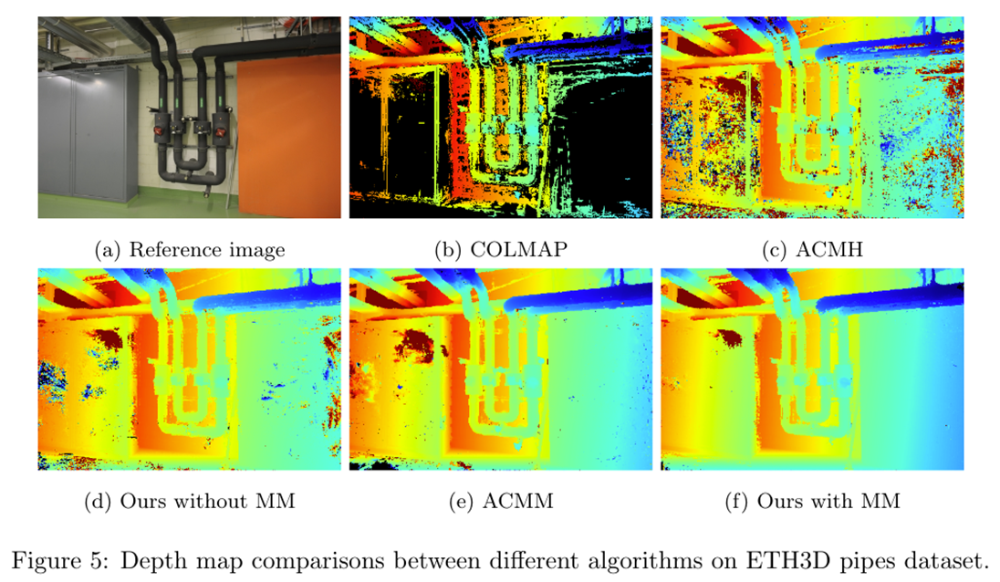
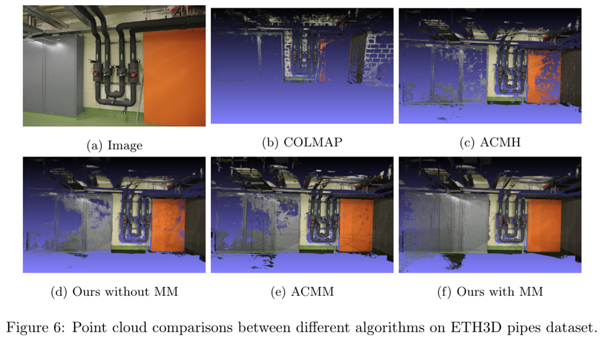

In this research project, we propose real-ACMM, which is a photorealistic 3D reconstruction method with MVS. The proposed real-ACMM is based on the architecture of [ACMM](https://arxiv.org/abs/1904.08103), and we make improvements on ACMM, achieving better reconstruction results with fewer iterations, especially in low-texture areas. The [code](https://github.com/EdgarFx/Photorealistic-3D-Reconstruction-with-Multi-view-Stereo) is open-sourced.

Our main contributions are:
* Proposed Broad Adaptive Checkerboard Sampling, which broadly considers all the pixels in a neighborhood window during pixel sampling, instead of extending in a specific direction. This method helps capture correct hypotheses in large low-texture areas.
* Introduced Dynamic Multi-Hypothesis Joint View Selection, which dynamically adjusts the matching cost for both the good matching and bad matching, allowing more robust and accurate view selection.
* Results show that the proposed method can achieve better reconstruction results with fewer iterations, especially in low-texture areas. 

## Results in ETH3D benchmark

