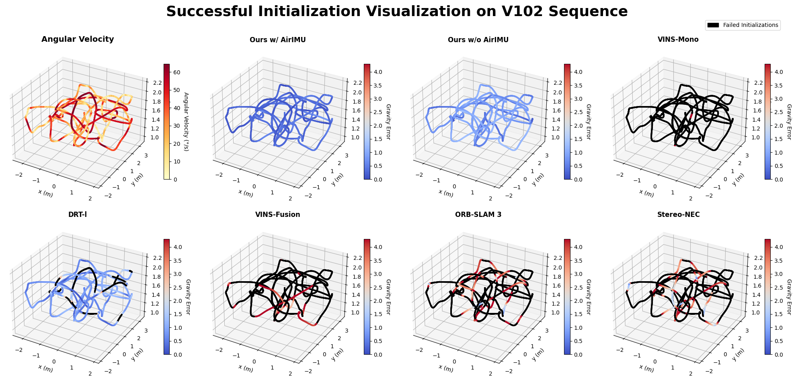
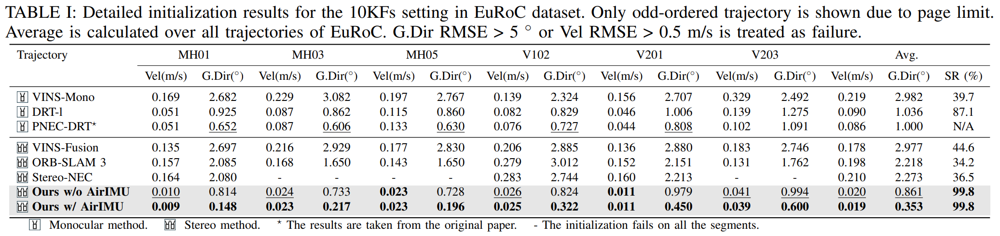
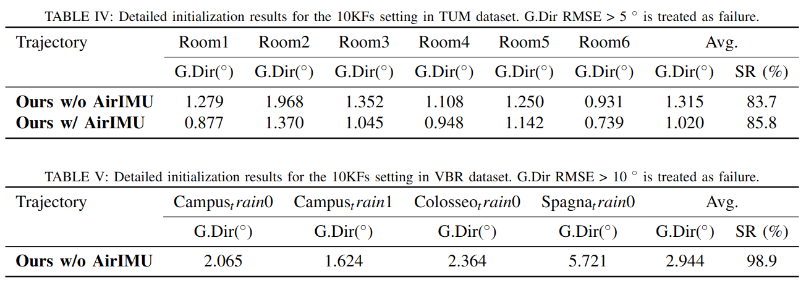
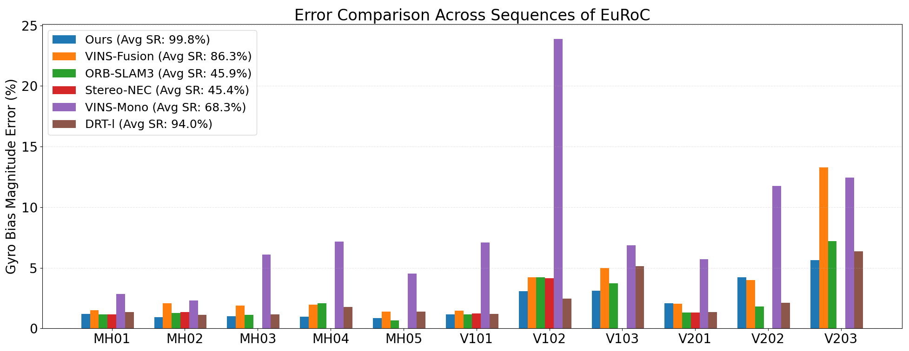
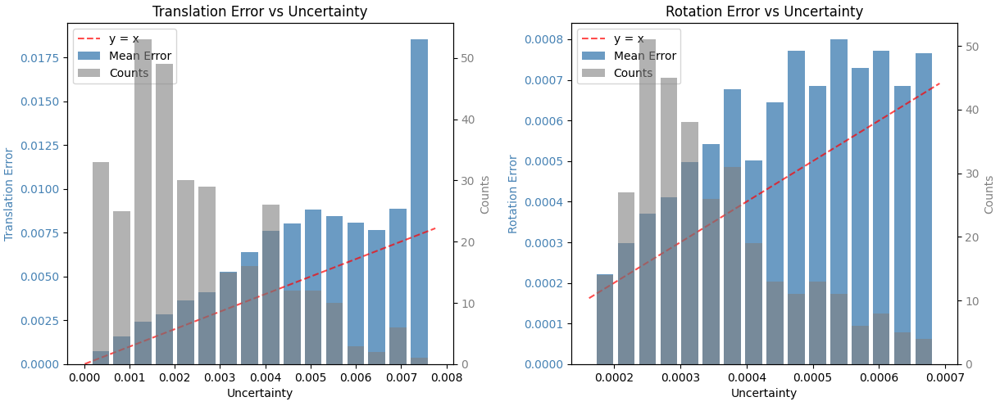
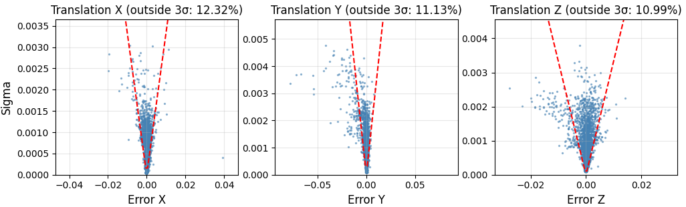
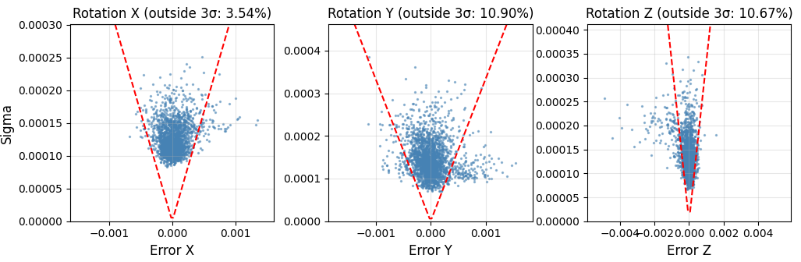

## Overview
Visual-inertial (VI) initialization and calibration are critical for the performance of VI systems, as they provide camera-IMU extrinsics and physically consistent initial state estimates for sensor fusion. However, traditional methods rely heavily on geometric feature correspondences and often struggle in challenging environments involving illumination changes, dynamic objects, and occlusions. In this paper, we present MAC-I$^2$, a robust VI initialization and online calibration framework that leverages learning-based visual features and uncertainty modeling. Specifically, we derive visual pose covariances from learned feature-matching uncertainties and adopt a learning-based IMU model to predict IMU integration covariances. Both visual and inertial covariances are metrics-aware, enabling principled and tuning-free VI initialization and calibration. Extensive experiments demonstrate that MAC-I$^2$ achieves significantly improved robustness and accuracy across a wide range of challenging scenarios where geometry-based methods often fail.

<!-- ## Video Demos
These videos illustrate the gravity-direction initialization results (Orange: estimated gravity; Green: ground truth) across different environments. Subsequent localization and mapping are carried out by jointly optimizing the visual pose graph (PGO) together with either standard IMU residuals or those from AirIMU. When AirIMU is used, the localization and mapping system effectively becomes **MACVIO**, a learning-based stereo visual-inertial odometry that we are also developing.

  <h3>Lunar Environment (TartanairV2 Dataset)</h3>
  <video width="100%" controls style="border-radius: 8px; box-shadow: 0 4px 6px rgba(0,0,0,0.1);">
    <source src="lunar.mp4" type="video/mp4">
    Your browser does not support the video tag.
  </video>

  

    <h3>VBR Colosseo Train 0 (Extreme Exposure)</h3>
    <video width="100%" controls style="border-radius: 8px; box-shadow: 0 4px 6px rgba(0,0,0,0.1);">
      <source src="vbr_light.mp4" type="video/mp4">
      Your browser does not support the video tag.
    </video>
  

  
  

    <h3>VBR Colosseo Train 0 (Dynamic Scene)</h3>
    <video width="100%" controls style="border-radius: 8px; box-shadow: 0 4px 6px rgba(0,0,0,0.1);">
      <source src="vbr_dynamic.mp4" type="video/mp4">
      Your browser does not support the video tag.
    </video>
  

  

    <h3>EuRoC V102</h3>
    <video width="100%" controls style="border-radius: 8px; box-shadow: 0 4px 6px rgba(0,0,0,0.1);">
      <source src="V102.mp4" type="video/mp4">
      Your browser does not support the video tag.
    </video>
  

  
  

    <h3>EuRoC V203</h3>
    <video width="100%" controls style="border-radius: 8px; box-shadow: 0 4px 6px rgba(0,0,0,0.1);">
      <source src="V203.mp4" type="video/mp4">
      Your browser does not support the video tag.
    </video>
  

  <h2>Successful Initialization Comparison on V102 Sequence of EuRoC Dataset</h2>
  

  <h2>Performance Comparison on EuRoC Dataset (SR in the table refers to the success rate)</h2>
  

  <h2>Performance of the proposed MAC-VI-Init on TUM and VBR Dataset</h2>
  

  <h2>Gyroscope Bias Estimation Comparison on EuRoC Dataset</h2>
  

  <h2>Pose Covariance Analysis on TartanAir Dataset</h2>
  

    
    
    
  

 -->